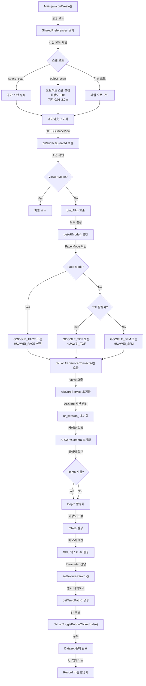
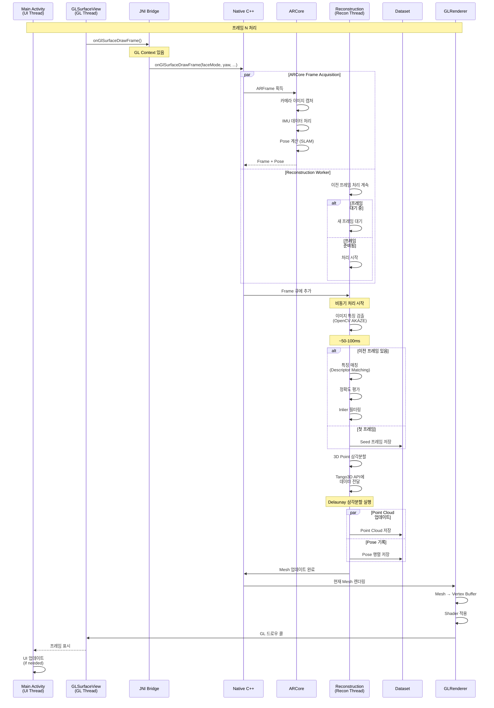
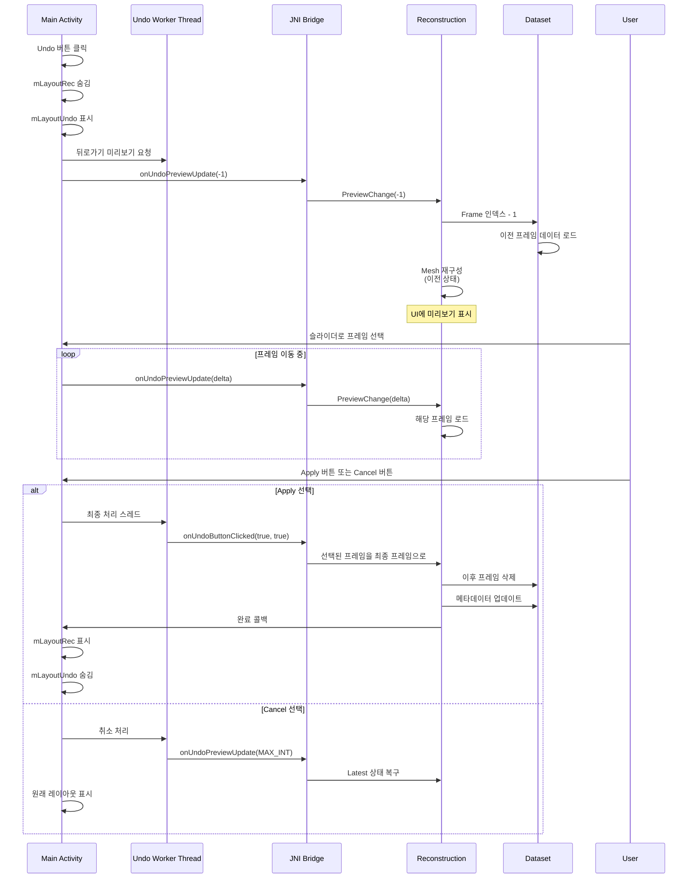
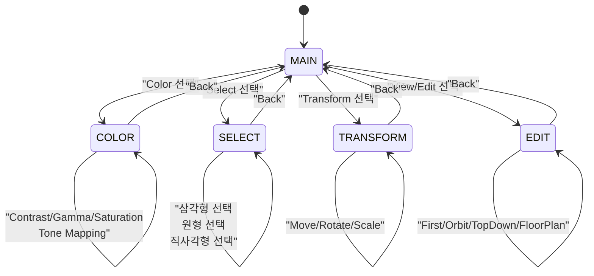
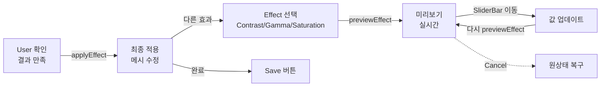
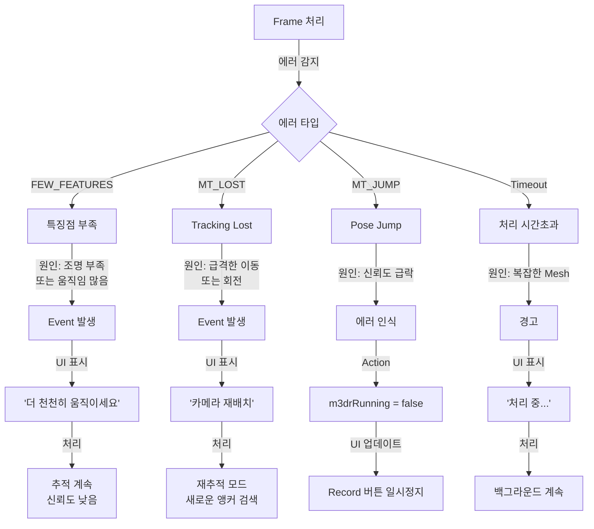

# 3D Live Scanner - 기능 상세 흐름도 & 시퀀스

## 📑 목차
1. [스캔 초기화 상세 프로세스](#1-스캔-초기화-상세-프로세스)
2. [실시간 프레임 처리](#2-실시간-프레임-처리)
3. [Undo 시스템](#3-undo-시스템)
4. [Editor 편집 프로세스](#4-editor-편집-프로세스)
5. [저장 및 Post-Processing](#5-저장-및-post-processing)
6. [에러 핸들링](#6-에러-핸들링)

---

## 1. 스캔 초기화 상세 프로세스

### 전체 흐름



### bindAR() 메서드 상세

```
bindAR() 메서드 실행 순서:
│
├─ 1. 스캔 모드별 해상도 설정
│  └─ space_scan: 기본값 유지
│  └─ object_scan: 0.01f, dmin=0.01, dmax=2.0
│
├─ 2. SharedPreferences에서 설정 로드
│  ├─ pref_anchor: 앵커 활용 여부
│  ├─ pref_noise: 노이즈 필터 (기본 9)
│  ├─ pref_subset: 정밀 분석 여부
│  ├─ pref_clear: 중복 제거 여부
│  ├─ pref_slow: Pose 보정 여부
│  ├─ pref_offset: 오프셋 활용 여부
│  ├─ pref_limit: 깊이 제한 (기본 4m)
│  ├─ pref_gps: GPS 기록 여부
│  └─ pref_poisson: Poisson 표면 재구성 여부
│
├─ 3. GPS 활성화 확인
│  └─ GPS.start() - 위치 정보 기록
│
├─ 4. Post-processing 모드 확인
│  └─ 텍스처 처리 필요 여부 판단
│
├─ 5. 메모리 정보 수집
│  ├─ ActivityManager.getMemoryInfo()
│  ├─ 총 메모리 계산
│  └─ GPU 텍스처 수 결정 (1~8)
│
├─ 6. JNI 파라미터 설정
│  ├─ setTextureParams(decimation, res, count)
│  └─ JNI.onARServiceConnected(...) 호출
│
├─ 7. Native AR 세션 초기화
│  ├─ ARCore 또는 AREngine 생성
│  ├─ 카메라 캘리브레이션 로드
│  ├─ Tango3D 세션 생성
│  └─ 임시 디렉토리 설정
│
├─ 8. 3D 재구성 스레드 시작
│  ├─ m3drRunning 플래그 설정
│  └─ Reconstruction.Start() 호출
│
└─ 9. UI 준비
   ├─ 레이아웃 표시/숨김
   ├─ 토글 버튼 상태 업데이트
   └─ CameraControl 초기화
```

---

## 2. 실시간 프레임 처리

### 한 프레임 처리 타임라인



### Pose Correction 플로우 (느린 모드)

```
느린 모드 (pref_slow = true) 활성화 시:

1. 포즈 보정 스레드 생성
   └─ Reconstruction.Start(POSE_CORRECTION)

2. 각 프레임에서:
   ├─ ARCore Pose (예비)
   ├─ GLRenderer로 깊이맵 렌더링
   │  └─ rendered_depth 생성
   │
   ├─ 현재 깊이맵과 비교
   │  ├─ 오차 계산 (ICP 유사)
   │  └─ Pose 조정값 계산
   │
   └─ 최종 Pose 결정
      └─ ARCore Pose 또는 보정된 Pose

3. 이점: 더 정확한 추적
   단점: 느린 처리 속도
```

### 에러 처리

```
프레임 처리 중 에러 발생 시:

1. Feature가 충분하지 않음
   ├─ Event: "FEW_FEATURES"
   ├─ UI: "더 천천히 움직이세요" 표시
   ├─ Action: 추적 계속 (낮은 신뢰도)
   └─ Recovery: 움직임 감소 시 복구

2. Tracking Lost
   ├─ Event: "MT_LOST"
   ├─ UI: "카메라 재배치 필요" 표시
   ├─ Action: 재구성 중지
   └─ Recovery: 마지막 좋은 Pose로 복구

3. AR Jump Detected
   ├─ didARjump() 반환 true
   ├─ m3drRunning = false
   ├─ UI: Record 버튼 일시정지 상태로
   └─ User Action: 재시작 필요
```

---

## 3. Undo 시스템

### Undo 스택 구조

```
Dataset에 저장된 Frame 구조:
┌─ Frame 0 (Seed Frame)
├─ Frame 1
├─ Frame 2
├─ Frame 3 (Current) ← onUndoButtonClicked() 호출
├─ Frame 4
└─ Frame 5 (Latest)

Undo 조작:
1. onUndoPreviewUpdate(-1)
   └─ Frame 2로 미리보기

2. onUndoPreviewUpdate(-10)
   └─ Frame 0으로 미리보기

3. onUndoButtonClicked(true, true)
   └─ 최종 확정 → Frame 2를 Latest로 변경
```

### Undo 상세 시퀀스



---

## 4. Editor 편집 프로세스

### Editor 상태 머신



### Editor 터치 이벤트 처리

```
Editor.onTouch() 상세:
│
├─ 1. 상태 확인
│  ├─ SELECT 모드?
│  │  ├─ applySelect() - 단일 삼각형
│  │  ├─ circleSelection() - 원형 영역
│  │  └─ rectSelection() - 직사각형 영역
│  │
│  ├─ COLOR 모드?
│  │  └─ SeekBar 값으로 미리보기
│  │     └─ previewEffect(effect, value, axis)
│  │
│  └─ TRANSFORM 모드?
│     ├─ MOVE: 터치 이동 거리 계산
│     ├─ ROTATE: 터치 회전각 계산
│     └─ SCALE: 터치 축소 비율 계산
│
├─ 2. 미리보기 업데이트
│  ├─ MotionEvent.ACTION_MOVE
│  └─ previewEffect() 호출 (NDF 수행 안 함)
│
├─ 3. 최종 적용
│  ├─ MotionEvent.ACTION_UP
│  └─ applyEffect() 호출
│
└─ 4. 화면 갱신
   └─ invalidate() → onDraw()
```

### Effect 처리 흐름



---

## 5. 저장 및 Post-Processing

### 저장 경로별 처리 로직

```mermaid
graph TD
    A["Main.save() 호출"] -->|모드 확인| B{"저장 모드"}
    
    B -->|Face Scan| C["Face Mode 저장"]
    C -->|1. JNI.save| D["OBJ 생성"]
    D -->|2. Service.forceState| E["SERVICE_POSTPROCESS"]
    E -->|3. 텍스처 처리| F["입음 완료"]
    
    B -->|Post Process Later| G["Dataset 저장"]
    G -->|1. Temp Dir| H[".dataset 디렉토리"]
    H -->|2. 타임스탬프| I["yyyyMMdd_HHmmss"]
    I -->|3. .bin 파일 삭제| J["메모리 절약"]
    J -->|4. 완료| K["홈 화면 복귀"]
    
    B -->|Realtime Export| L["즉시 내보내기"]
    L -->|1. SERVICE_SAVE| M["저장 서비스 시작"]
    M -->|2. OBJ 저장| N["model.obj + textures"]
    N -->|3. PLY 생성| O["pointcloud.ply"]
    O -->|4. 완료| P["파일 관리자 표시"]
    
    K -->|Post-Process 진행| Q["HomeActivity.finishScanning()"]
    Q -->|1. 파일 열기| R["Service.getLink()"]
    R -->|2. Exporter.export()| S["파일명 변경"]
    S -->|3. PLY 이동| T["OBJ 폴더로"]
    T -->|5. 임시 디렉토리| U["삭제"]
    U -->|6. 재시작| V["Main.class (Viewer)"]
```

### Post-Processing 상세

```
Service.process() 콜백 실행:

1. Texturize 준비
   ├─ Reconstruction.InitTexturing()
   ├─ 카메라 프레임 재로드
   └─ 첫 프레임부터 시작

2. Texturize 실행
   ├─ jni.texturize(input, output, poisson, twoPass)
   ├─ 각 정점 위치에 해당하는 픽셀 색상 매핑
   └─ 법선 매핑 계산

3. Poisson 재구성 (Optional)
   ├─ 표면 부드럽게 정렬
   ├─ 구멍 채우기
   └─ 고품질 메시 생성

4. Two-Pass Mode
   ├─ Pass 1: 빠른 텍스처 맵핑
   └─ Pass 2: 세부사항 보강

5. 내보내기
   ├─ OBJ + MTL 생성
   ├─ PNG/JPG 텍스처 저장
   └─ 파일 정렬

6. 완료
   ├─ Service.finish()
   ├─ 임시 폴더 정리
   └─ 앱 종료 또는 Viewer 실행
```

### Export 포맷별 처리

```
1. OBJ + Texture (기본)
   ├─ model.obj (정점, 면, UV 좌표)
   ├─ model.mtl (재질 정보)
   ├─ texture.png (칼라 텍스처)
   └─ normal.png (옵션: 법선맵)

2. PLY (Point Cloud)
   ├─ ASCII 형식
   ├─ 정점 위치
   ├─ RGB 색상
   └─ Normal 벡터

3. CSV (Pose Information)
   ├─ 프레임별 카메라 위치
   ├─ 회전 행렬
   └─ 타임스탬프

4. Floor Plan (평면도)
   ├─ 천장 뷰
   ├─ PNG 이미지
   └─ SVG 벡터
```

---

## 6. 에러 핸들링

### AR 트래킹 에러 처리



### 저장 실패 처리

```
JNI.save() 실패 시:

1. 반환값 확인
   └─ false 반환

2. 에러 콜백
   ├─ showAndroidBugDialog()
   ├─ Android 버그 안내 (API 30+)
   └─ 해결책 링크 제공

3. 사용자 액션
   ├─ "수동으로 해결" 버튼
   │  └─ 웹사이트 오픈
   ├─ "취소" 버튼
   │  └─ 앱 종료
   └─ 타임아웃
      └─ 앱 강제 종료

4. 로그 기록
   └─ Log.e(TAG, "Unable to save...")
```

### 메모리 부족 처리

```
ActivityManager.getMemoryInfo() 확인:

1. 사용 가능 메모리 계산
   ├─ memInfo.totalMem / 1048576 = MB
   └─ MB / 512 = 기본 텍스처 수

2. 텍스처 수 제한
   ├─ min(max(1, calculated), 8)
   ├─ 최소: 1개
   └─ 최대: 8개

3. 설정 우선순위
   ├─ 사용자 설정 확인
   ├─ "pref_textures" 선호도 존중
   └─ 기본값: 4개

4. 메모리 부족 시
   ├─ 텍스처 수 감소
   ├─ 해상도 증가 (낮은 품질)
   ├─ Poisson 비활성화
   └─ 경고 메시지 표시
```

### Permission 에러 처리

```
checkPermissions() 프로세스:

필요 권한:
├─ Manifest.permission.CAMERA
├─ Manifest.permission.WRITE_EXTERNAL_STORAGE (API < 30)
├─ Manifest.permission.READ_EXTERNAL_STORAGE
└─ Manifest.permission.ACCESS_FINE_LOCATION (GPS)

실패 시:
1. requestPermissions() 호출
2. onRequestPermissionsResult() 콜백
3. 모든 권한 확인
4. 부족한 권한 있으면
   ├─ Toast 메시지 표시
   ├─ "카메라 권한이 필요합니다"
   └─ 설정 화면 유도
```

---

## 📊 성능 모니터링 포인트

### 주요 지표

| 지표 | 목표값 | 측정 방법 |
|------|-------|---------|
| **Frame Rate** | 30 FPS | onGlSurfaceDrawFrame 호출 주기 |
| **Tracking Latency** | < 50ms | ARCore.Process() 실행 시간 |
| **Feature Extraction** | < 100ms | OpenCV AKAZE 처리 시간 |
| **Mesh Generation** | < 500ms | Tango3D 삼각분할 시간 |
| **Texturize** | Variable | Poisson 알고리즘 시간 |
| **Memory Usage** | < 60% | Runtime.getRuntime().totalMemory() |

### 디버깅 팁

```
1. Logcat 필터링
   ├─ adb logcat *:S arcore_app:V
   ├─ "[EVENT]" 패턴 검색
   └─ Native 출력 확인

2. Frame 프로파일링
   ├─ Android Profiler
   ├─ CPU/GPU/Memory 그래프
   └─ 병목 지점 파악

3. Native 디버깅
   ├─ Android Studio NDK 디버거
   ├─ 중단점 설정
   └─ 변수 검사

4. 에러 콜렉션
   └─ Firebase Crashlytics
```

