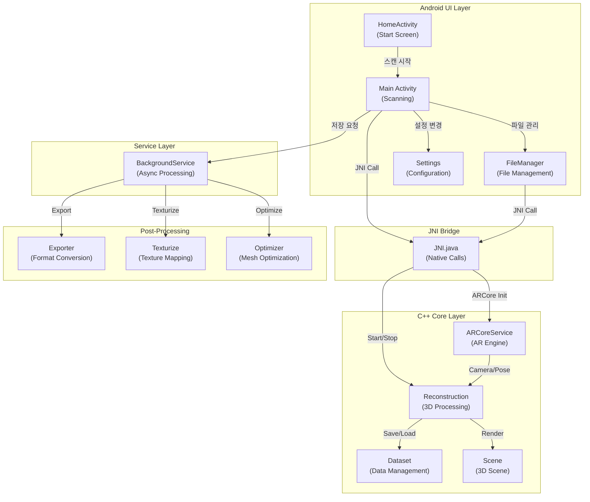
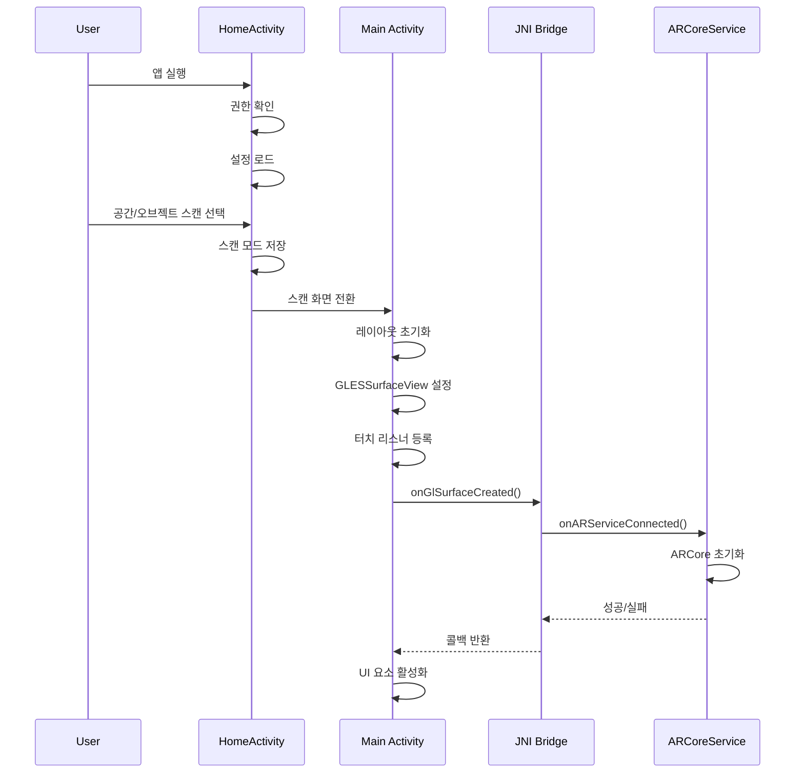
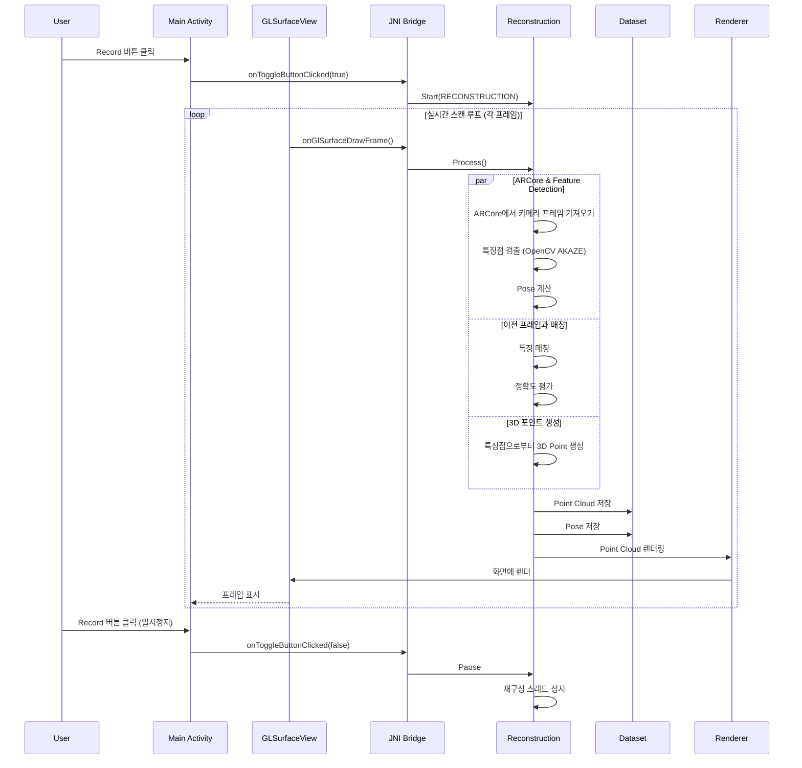
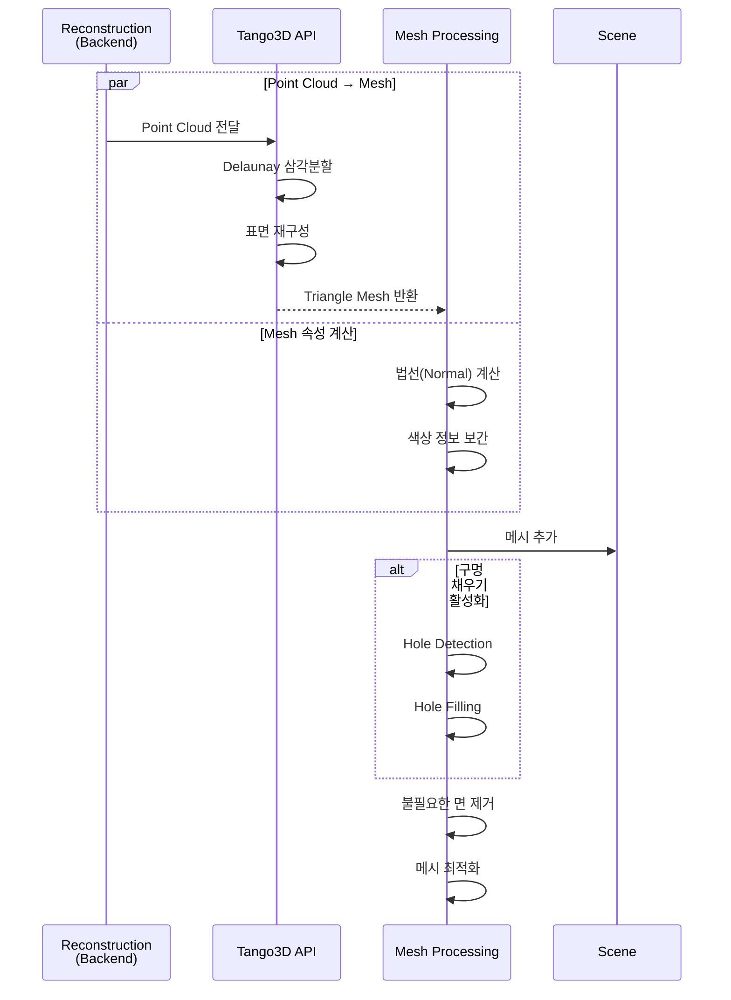
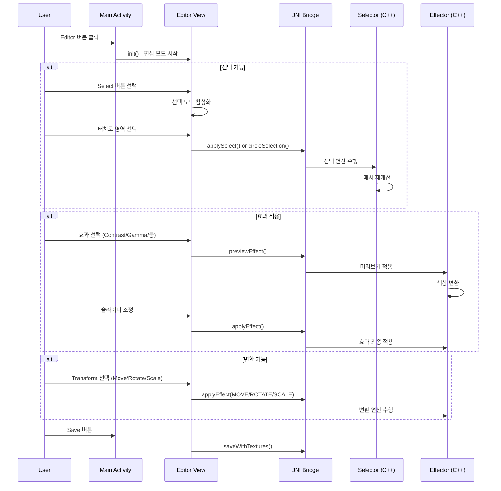
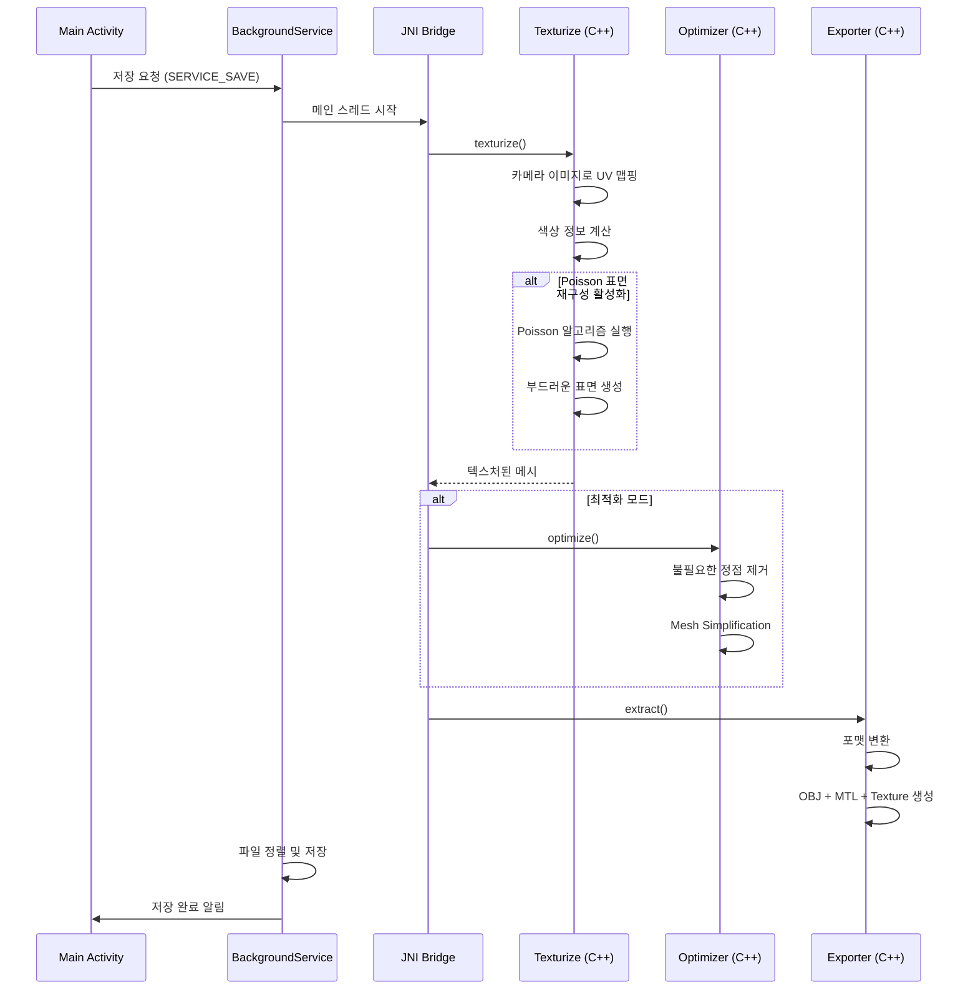
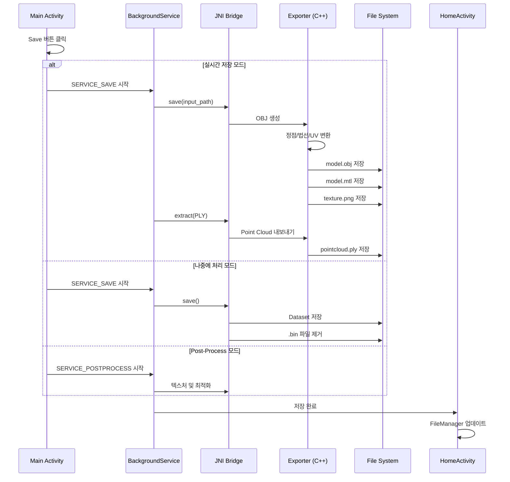
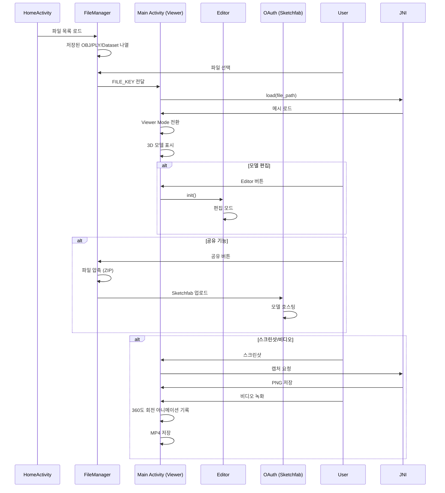
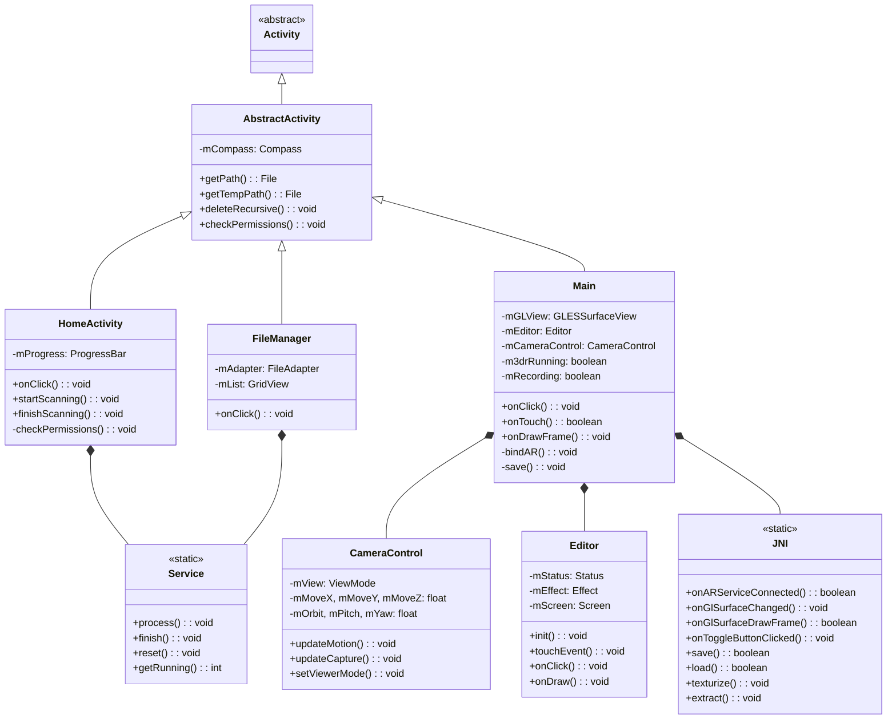
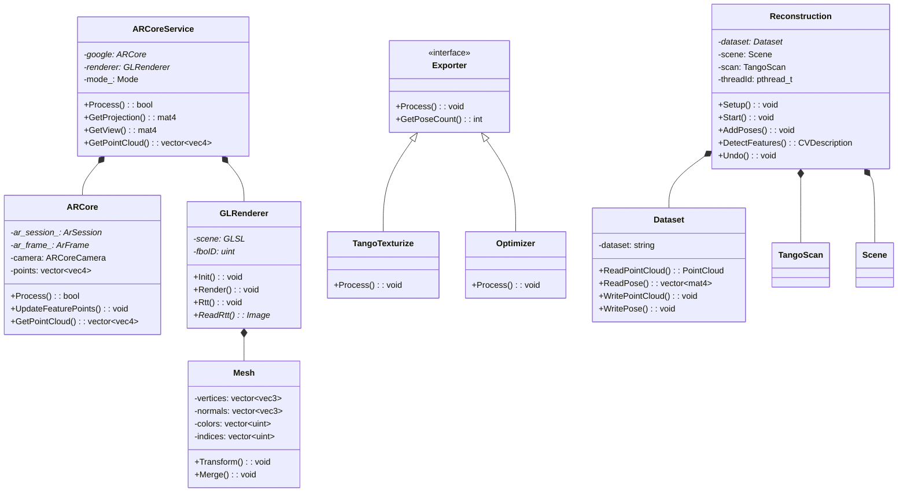

# 3D Live Scanner 프로젝트 아키텍처 분석

## 📋 목차
1. [프로젝트 개요](#프로젝트-개요)
2. [디렉토리 구조](#디렉토리-구조)
3. [핵심 아키텍처](#핵심-아키텍처)
4. [모듈별 기능](#모듈별-기능)
5. [기능 흐름도](#기능-흐름도)
6. [클래스 다이어그램](#클래스-다이어그램)

---

## 프로젝트 개요

**3D Live Scanner**는 Android 기반의 AR 3D 스캔 애플리케이션입니다.
- **언어**: Java (Android UI), C++ (Core 3D Processing)
- **AR 엔진**: Google ARCore (Primary), Huawei AREngine (Alternative)
- **3D 처리**: Tango 3D Reconstruction API
- **목표**: 실시간 3D 스캔, 편집, 내보내기

---

## 디렉토리 구조

```
App/
├── arcore/              # ARCore 바이너리 및 헤더
│   ├── include/
│   └── jni/             # 기기별 native 라이브러리
│
├── common/              # C++ 핵심 로직
│   ├── ar/              # Java AR 유틸리티
│   ├── arcore/          # ARCore 래퍼
│   │   ├── arcore.h/cc
│   │   ├── arengine.h/cc
│   │   ├── camera.h/cc
│   │   └── service.h/cc
│   │
│   ├── data/            # 데이터 구조 및 처리
│   │   ├── dataset.h/cc
│   │   ├── depthmap.h/cc
│   │   ├── image.h/cc
│   │   └── mesh.h/cc
│   │
│   ├── editor/          # 3D 편집 모듈
│   │   ├── effector.h/cc
│   │   ├── rasterizer.h/cc
│   │   └── selector.h/cc
│   │
│   ├── exporter/        # 포맷 변환 및 내보내기
│   │   ├── exporter.h/cc
│   │   ├── ply.h/cc
│   │   ├── floorpln.h/cc
│   │   └── csvposes.h/cc
│   │
│   ├── gl/              # OpenGL 렌더링
│   │   ├── renderer.h/cc
│   │   ├── camera.h/cc
│   │   ├── scene.h/cc
│   │   └── glsl.h/cc
│   │
│   ├── postproc/        # 후처리
│   │   ├── optimizer.h/cc
│   │   ├── poisson.h/cc
│   │   └── texturize.h/cc
│   │
│   ├── thread/          # 멀티스레딩 처리
│   │   ├── reconstr.h/cc    # 메인 재구성 엔진
│   │   └── scene.h/cc
│   │
│   ├── tango/           # Tango 3D Reconstruction
│   │   ├── retango.h/cc
│   │   ├── scan.h/cc
│   │   └── texturize.h/cc
│   │
│   └── utils/           # 유틸리티
│
├── scanner/             # Android Gradle 프로젝트
│   ├── app/src/main/
│   │   ├── java/com/snapspace/scanner/
│   │   │   ├── core/           # (현재 비어있음)
│   │   │   ├── main/           # 메인 스캔 로직
│   │   │   │   ├── Main.java
│   │   │   │   ├── CameraControl.java
│   │   │   │   ├── Editor.java
│   │   │   │   ├── Exporter.java
│   │   │   │   ├── JNI.java
│   │   │   │   ├── DistanceMeasuring.java
│   │   │   │   ├── HandMotionView.java
│   │   │   │   └── Indicators.java
│   │   │   │
│   │   │   ├── ui/             # UI 및 파일 관리
│   │   │   │   ├── HomeActivity.java
│   │   │   │   ├── FileManager.java
│   │   │   │   ├── Service.java (Background Service)
│   │   │   │   ├── AbstractActivity.java
│   │   │   │   ├── Settings.java
│   │   │   │   └── Common UI Utilities
│   │   │   │
│   │   │   └── sketchfab/      # 3D 모델 업로드
│   │   │
│   │   └── res/                # XML 리소스
│   │
│   ├── build.gradle
│   └── gradle.properties
│
└── third_party/         # 외부 라이브러리
    ├── glm/             # GLM 수학 라이브러리
    ├── delaunay/        # Delaunay 삼각분할
    ├── glm/
    ├── libjpeg-turbo/
    ├── libpng/
    ├── opencv/          # 이미지 처리 (특징 추출)
    └── poisson/         # Poisson 표면 재구성
```

---

## 핵심 아키텍처

### 계층 구조 (Layer Architecture)

```
┌─────────────────────────────────────┐
│     User Interface Layer (Android)  │
│  HomeActivity → Main → FileManager  │
└──────────────┬──────────────────────┘
               │ JNI (Native Interface)
┌──────────────▼──────────────────────┐
│    Android Wrapper Layer (C++)      │
│  ARCoreService → Reconstruction     │
└──────────────┬──────────────────────┘
               │
┌──────────────▼──────────────────────┐
│     Core Processing Layer (C++)     │
│  Tango3D ← Dataset → GL Renderer    │
│  ARCore ← Camera → Mesh Processing  │
└──────────────┬──────────────────────┘
               │
┌──────────────▼──────────────────────┐
│      Graphics & Data Layer (C++)    │
│  OpenGL → GLRenderer → Mesh/Image   │
└─────────────────────────────────────┘
```

### 핵심 컴포넌트 관계도



---

## 모듈별 기능

### 1️⃣ **UI Layer** (Java - Android)

#### HomeActivity
- **역할**: 애플리케이션 시작 화면
- **기능**:
  - 공간 스캔 모드 선택
  - 오브젝트 스캔 모드 선택
  - 스캔 미리보기 기능
  - 서버 업로드 버튼
  - 권한 확인 및 요청

#### Main Activity
- **역할**: 메인 스캔 인터페이스 (가장 복잡한 UI)
- **주요 컴포넌트**:
  - `GLESSurfaceView`: OpenGL 렌더링 화면
  - `CameraControl`: 카메라 뷰 제어
  - `Editor`: 3D 모델 편집
  - `DistanceMeasuring`: 거리 측정
  - `Indicators`: 상태 표시
- **기능**:
  - 실시간 AR 스캔
  - 토글 버튼 (Record/Pause)
  - Clear (스캔 초기화)
  - Undo (되돌리기)
  - View Mode (뷰 전환)
  - Save (저장)
  - Editor 모드 (3D 편집)
  - Photo Mode (사진 캡처)
  - GPS 좌표 기록

#### FileManager
- **역할**: 저장된 파일 관리
- **기능**:
  - 파일 목록 조회 (GridView)
  - 파일 미리보기
  - 파일 삭제/이름 변경
  - 파일 공유 (Sketchfab)
  - 위치 정보 관리

#### Settings
- **역할**: 애플리케이션 설정
- **주요 설정**:
  - AR 모드 선택 (Google vs Huawei)
  - Face Mode 토글
  - ToF 카메라 사용 여부
  - 노이즈 필터 강도
  - 텍스처 해상도
  - GPU 메모리 할당
  - Poisson 표면 재구성 여부

### 2️⃣ **Service Layer** (Background Processing)

#### BackgroundService (Service.java)
```
역할: 비동기 작업 수행
상태 관리:
  - SERVICE_NOT_RUNNING (0)
  - SERVICE_POSTPROCESS (1)
  - SERVICE_SAVE (2)
  - SERVICE_SKETCHFAB (3)
  - SERVICE_PHOTOGRAMMETRY (4)
```

### 3️⃣ **ARCore Wrapper** (C++ - arcore/)

#### ARCoreService
- **지원 모드**:
  - GOOGLE_SFM (Structure from Motion)
  - GOOGLE_TOF (Time of Flight)
  - GOOGLE_FACE (Face Scanning)
  - HUAWEI_SFM (대체 엔진)
  - HUAWEI_TOF
  - HUAWEI_FACE

- **주요 기능**:
  - AR 카메라 초기화 및 관리
  - Frame 처리 (이미지 + Pose)
  - Point Cloud 생성
  - Feature Detection
  - Pose Estimation
  - Depth Map 제공
  - Face Mesh 생성 (Face Mode)

### 4️⃣ **3D 데이터 처리** (C++ - data/)

#### Image
- RGB/Depth 이미지 저장 및 처리
- 이미지 포맷 변환

#### Mesh
- 3D 메시 구조 (정점, 노멀, UV, 색상)
- 메시 연산 (병합, 변환 등)

#### PointCloud
- 특징점 모음
- 깊이 맵 정보

#### Dataset
- 스캔 데이터 저장/로드
- Frame별 Pose 정보 관리
- 카메라 캘리브레이션 저장
- 왜곡(Distortion) 정보 저장

### 5️⃣ **3D 재구성 엔진** (C++ - thread/reconstr.h)

#### Reconstruction Class
```cpp
주요 기능:
- AddPoses(): 프레임별 Pose 데이터 추가
- DetectFeatures(): 이미지 특징점 검출 (OpenCV)
- GetAccuracy(): 특징 매칭 정확도 계산
- Start(): 멀티스레드 기반 재구성 시작
- Undo(): 이전 상태로 복원
- PreviewChange(): Undo 미리보기
```

**재구성 스레드 타입**:
1. **DUMMY**: 테스트용
2. **POSE_CORRECTION**: 포즈 오차 보정
3. **RECONSTRUCTION**: 메인 3D 재구성

### 6️⃣ **3D 렌더링** (C++ - gl/)

#### GLRenderer
- **초기화**: `Init(width, height, rttWidth, rttHeight)`
- **렌더링**: `Render(vertices, normals, uv, colors, indices)`
- **FBO 렌더링**: `Rtt(enable)` - 오프스크린 렌더링 (스크린샷/비디오)
- **카메라**: `GLCamera` 객체로 뷰 변환 제어

### 7️⃣ **3D 편집** (Java - main/Editor.java)

#### Editor Features
- **Select (선택)**:
  - 삼각형 선택
  - 원형 선택 (Circle)
  - 직사각형 선택 (Rect)
  - 전체 선택/해제

- **Colors (색상)**:
  - Contrast 조정
  - Gamma 보정
  - Saturation 조정
  - Tone Mapping

- **Transform (변환)**:
  - Move (이동)
  - Rotate (회전)
  - Scale (스케일)

- **View (뷰)**:
  - First Person
  - Orbit
  - Top Down
  - Floor Plan

### 8️⃣ **후처리 및 내보내기** (C++ - postproc/, exporter/)

#### Texturize
- 메시에 텍스처 맵핑
- Poisson 표면 재구성 (선택사항)

#### Optimizer
- 메시 최적화
- 면 감소 (Simplification)
- 구멍 채우기 (Hole Filling)

#### Exporter
- **출력 포맷**:
  - OBJ + MTL + Texture
  - PLY (Point Cloud)
  - CSV (Pose 정보)
  - Floor Plan (평면도)

---

## 기능 흐름도

### 🔵 **1. 애플리케이션 시작 및 초기화**



### 🔴 **2. 실시간 스캔 프로세스**



### 🟢 **3. 3D 메시 생성 및 최적화**



### 🟠 **4. 편집(Editor) 프로세스**



### 🟡 **5. 텍스처 맵핑 및 최종 처리**



### 🔵 **6. 파일 저장 및 내보내기**



### 🟢 **7. 파일 보기 및 공유**



---

## 클래스 다이어그램

### Java 클래스 구조



### C++ 클래스 구조



---

## 💡 주요 기술 요소

| 기술 | 용도 | 상태 |
|------|------|------|
| **ARCore** | 모션 추적, 특징 추출 | ✅ |
| **Tango 3D Reconstruction** | 메시 생성 | ✅ |
| **OpenGL ES** | 실시간 렌더링 | ✅ |
| **OpenCV** | 이미지 특징 검출 | ✅ |
| **Poisson** | 표면 재구성 | ✅ |
| **Delaunay** | 삼각분할 | ✅ |
| **GLM** | 수학 연산 | ✅ |

---

## 🔄 데이터 흐름 요약

```
카메라 프레임 → ARCore 추적 → 특징 검출(OpenCV)
    ↓
특징 매칭 → Pose 계산 → 3D Point 생성
    ↓
Point Cloud → Tango3D API → Mesh 생성
    ↓
Mesh 최적화 → Texturize → Export (OBJ/PLY/etc)
    ↓
FileSystem 저장 → FileManager 표시
```

---

## 📊 성능 최적화 포인트

1. **메모리 관리**: 
   - GPU 메모리 할당 (텍스처 개수: 1~8)
   - 해상도 조정 (Default: 0.02f)

2. **렌더링**:
   - FBO를 통한 오프스크린 렌더링
   - 동적 LOD (Level of Detail)

3. **3D 재구성**:
   - 멀티스레드 처리
   - 특징 매칭 최적화
   - Pose 오차 보정

4. **네트워크**:
   - Sketchfab API를 통한 직접 업로드

---

## 🎯 다음 개발 단계

1. ✅ 전체 코드 구조 파악
2. 🔄 기능별 상세 분석 (Current)
3. 📝 새로운 기능 개발 계획 수립
4. 💻 구현 및 테스트

