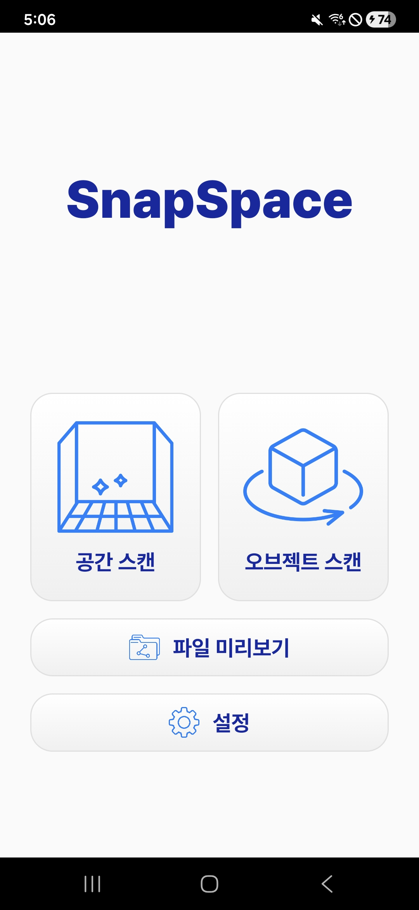
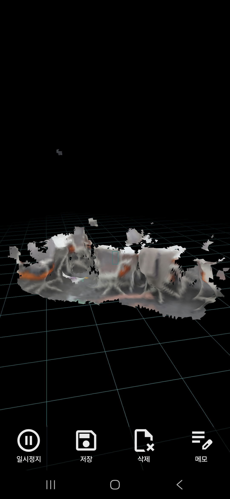
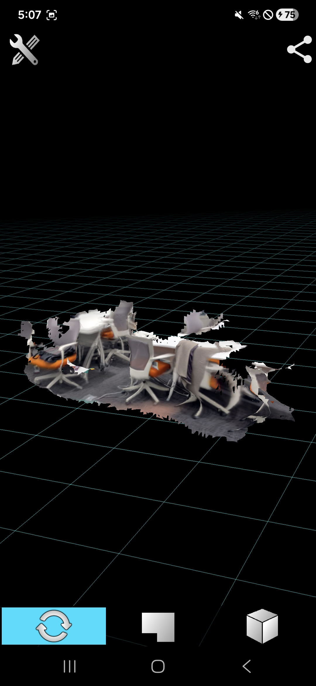
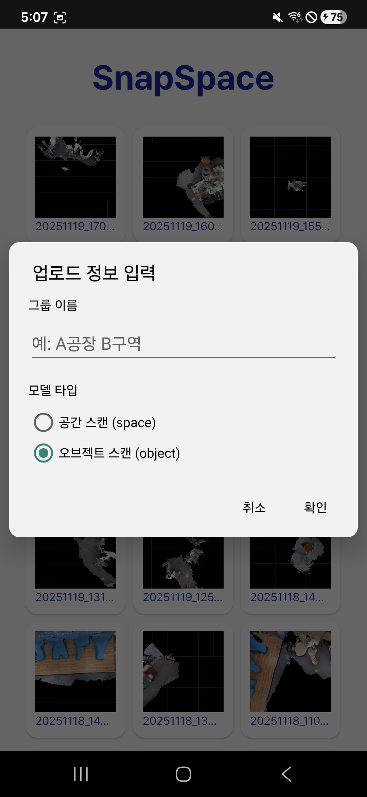

# 3. 📄 WALL-E 로봇 제어 시스템 시연 시나리오

## 1. 문서 개요

**문서명**: 스마트폰 및 AI 기반 제조 현장 3D 스캔 솔루션 개발 프로젝트 시연 시나리오

**목적**: SnapSpace 어플리케이션 및 유니티 기반 정합 툴의 시연 방법과 절차를 안내합니다.

**대상**: 시연자, 발표자

## 2. 시연 개요

**시연 제목**: SnapSpace 3D 스캔 솔루션 앱 사용 및 정합 툴 사용 시연

**시연 목적**: 스마트폰 기반의 3D 스캐너의 사용성과 실제 현장에서 연계하여 사용하게 될 정합 툴의 사용성을 보여줍니다.

**시연 시간**: 약 5~10분

## 3. 시연 준비물

### 3.1 하드웨어
- **컴퓨터**: Windows 10/11 (웹 브라우저 지원)
- **스마트폰**: Android 기반 스마트폰 (Galaxy S20+ & Galaxy S24+)

### 3.2 소프트웨어
- **웹 브라우저**: Chrome, Edge (최신 버전)
- **SnapSpace**: Android 애플리케이션

### 3.3 시연 데이터
- **공간 데이터**: 사전에 모델링 된 멀티캠퍼스 공간 (멀티캠퍼스 10층 작업실)
- **3D 스캔 데이터**: 시연에서 촬영하는 데이터 이외에 미리 스캔한 3D 스캔 데이터

## 4. 시연 단계

### 4.1 1단계: 스마트폰 어플리케이션 접속 및 3D 스캔

#### 4.1.1 스마트폰 어플리케이션 접속
1. **스마트폰 어플리케이션 접속**
   - 준비된 스마트폰에 미리 APK 파일 설치
   - SnapSpace 어플리케이션 접속

2. **초기 화면 확인**
   - 어플리케이션에서 제공하는 기능 확인

*그림 1: 어플리케이션 초기 화면*

#### 4.1.2 3D 공간 스캔
1. **실시간 3D 공간 스캔**
   - 예정된 공간(멀티캠퍼스 10층 작업실)에 대해 3D 공간 스캔 진행
   - 너무 큰 공간을 스캔하는 경우 데이터 처리에 긴 시간이 걸리기 때문에 발표 시간을 고려하여 적당한 크기의 공간만 스캔

2. **실시간 스캔 미리보기**
   - 스캔과 동시에 생성되는 3D 모덷 확인

*그림 2: 3D 스캔 및 실시간 모델 생성 화면*

*그림 3: 3D 스캔 결과 확인*

### 4.2 2단계: 3D 스캔 데이터 공유

#### 4.2.1 스캔 데이터 공유
1. **스캔 데이터 선택 및 공유**
   - 촬영한 스캔 데이터를 선택
   - 구축한 서버로 전송

*그림 4: 스캔 데이터 공유*

### 4.3 3단계: 정합 툴(유니티) 사용

#### 4.3.1 기존 데이터 불러오기
1. **데이터 불러오기**
   - 미리 제작한 3D 모델링 공간 불러오기

2. **스캔한 3D 모델 데이터 배치하기**
   - 필요한 위치에 스캔한 3D 모델 데이터를 배치

#### 4.3.2 데이터 내보내기
1. **배치 완료한 데이터 내보내기**
   - 스캔한 데이터를 배치한 후, 해당 데이터를 다시 불러와 사용할 수 있도록 데이터 내보내기